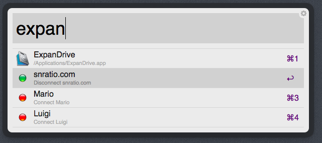

ExpanDrive for Alfred
=====================

Requirements
------------
This workflow requires ExpanDrive 3.X, as well as Alfred 2.X. Download and open the .workflow file to install.

**Note:**  The ExpanDrive Terminal Utility must be installed to use this workflow. 

`ExpanDrive Manager > Settings > Terminal Utility > Install` 

If the Terminal Utility is installed in a location other than /usr/bin, edit the path on the first line of the script filter within Alfred 2 under the ExpanDrive workflow with the full path to the `expan` utility.

Usage
-----
Invoke Alfred 2, and type `expan` to list all of the configured and available Servers. When selecting a single server, it will toggle its state. So, for instance if the server is currently not connected, selecting that server will connect it via ExpanDrive. If a server is connected when selected from the workflow, it will be ejected.

Screenshot
----------

